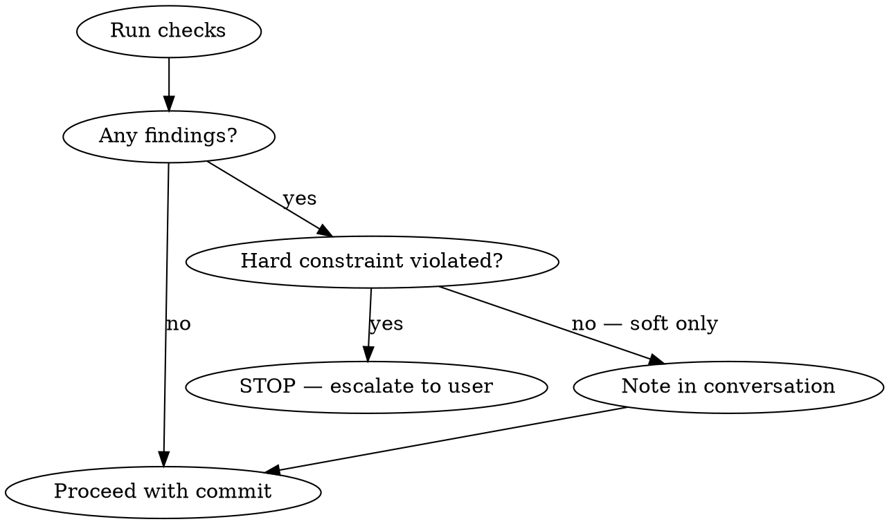

# Preflight Check

Validate architectural constraints before committing. Advisory to you (Claude) — only escalate hard constraint violations to the user.

## Bootstrap Gate

If no `.compos/` directory exists, skip preflight silently. Orientation and logging skills handle initialization.

## Flow

1. **Identify changed files** — use git, not conversation memory:
   ```bash
   git diff --name-only HEAD
   git diff --name-only --cached
   ```

2. **Check constraints:**
   ```
   get_constraints_for_components(file_paths=["path/to/changed1.py", "path/to/changed2.py"])
   ```

3. **If new relationships were registered this session** (by the architectural-logging skill):
   ```
   evaluate_proposed_change(proposed_relationships=[...])
   ```
   This detects cycles, single-points-of-failure, and constraint conflicts. Only call when new relationships exist — skip for modifications to existing components.

4. **Evaluate findings by severity:**



**CLEAN PASS:** One-line note, proceed.
`"Preflight clean. No constraint violations."`

**SOFT FINDINGS:** Note in conversation or commit message, proceed without interruption.
`"Note: soft constraint on api-gateway response time — new cache layer adds a hop but should improve p99."`

**HARD CONSTRAINT VIOLATION:** Stop. Surface to user regardless of auto-mode.
`"Hard constraint violated: [description]. Affected: [component]. This requires your call."`

## Hard vs Soft

This distinction is data-driven from the constraint's `hardness` field — not your judgment.
- **Hard** (`hardness: "hard"`): Must not violate. Always escalate.
- **Soft** (`hardness: "soft"`): Prefer not to violate. Note but proceed.

## Do NOT

- Rely on conversation memory for changed files — use `git diff --name-only`
- Show an architectural delta — the logging skill already reported changes
- Call `evaluate_proposed_change` when no new relationships were added
- Pause for user confirmation on soft findings or clean passes
- Skip preflight because "the changes are small"
